# Smashball

### About
- **Smashball** is fun physics-based mobile  game developed in C++ using [cocos2dx](https://cocos2d-x.org/) game engine

### Demo
- Click on the image below to watch a video walkthrough on YouTube

### Repository structure
-  `Classes` contains the source code
-  `Resources` contains the assets/resources
    
### Installation
- [APK](https://drive.google.com/file/d/1GQ39zYNNVaLFEUTjpn9i_2CJ6hYS0ymM/view?usp=sharing)

### Screenshots
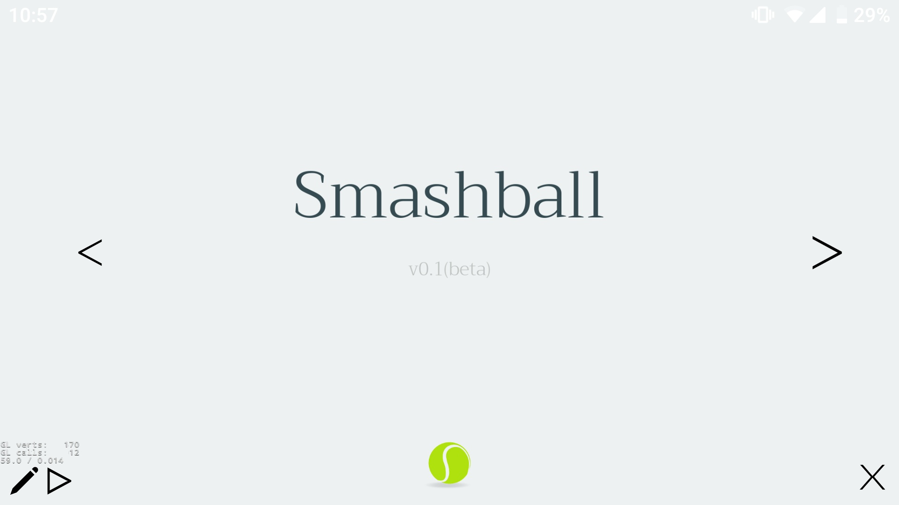

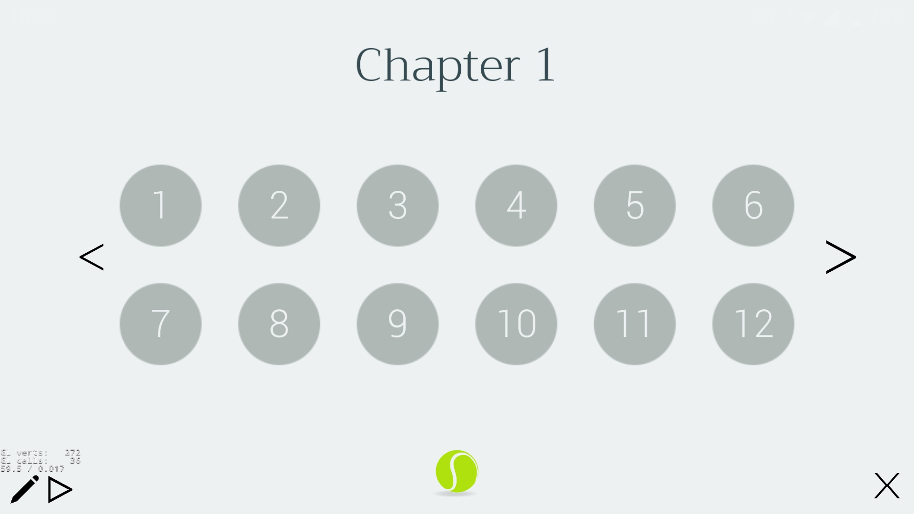

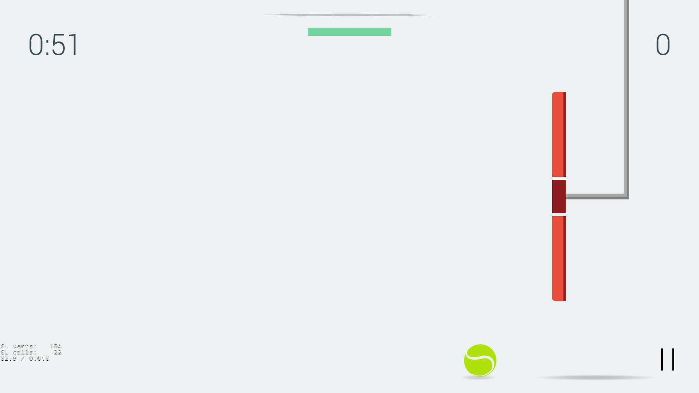

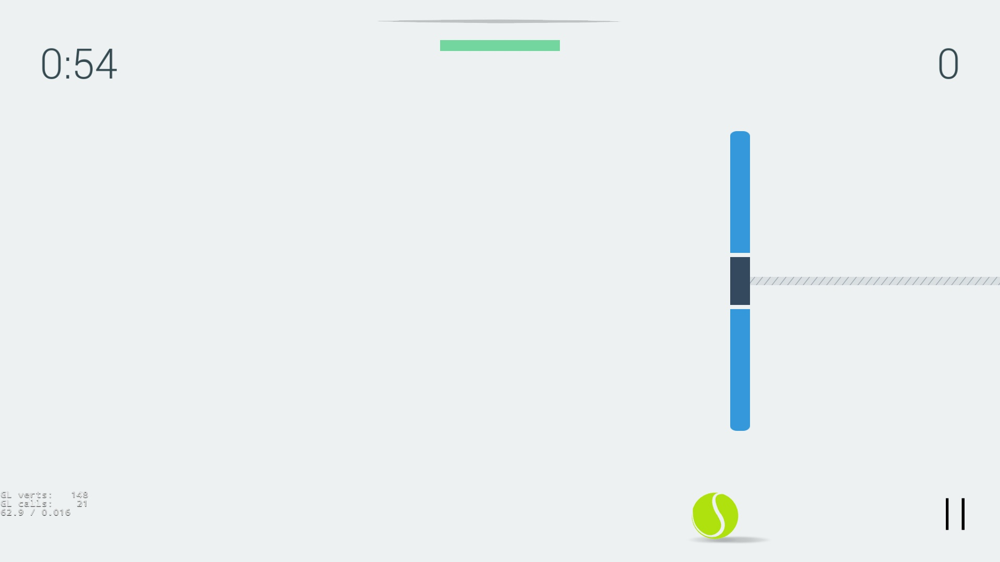

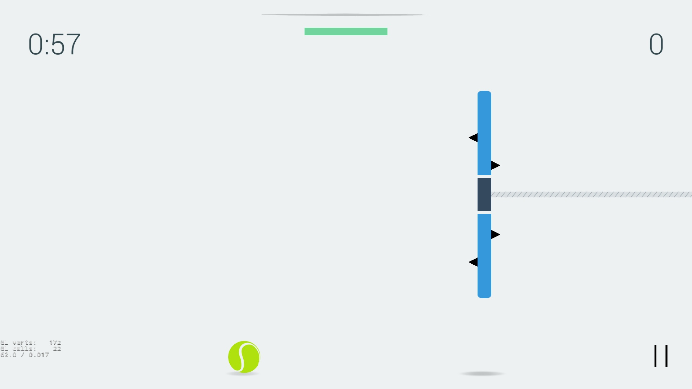

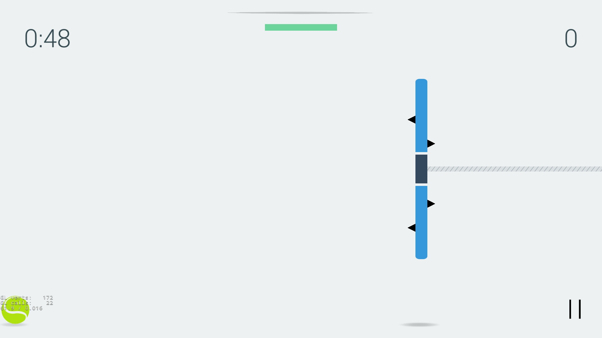

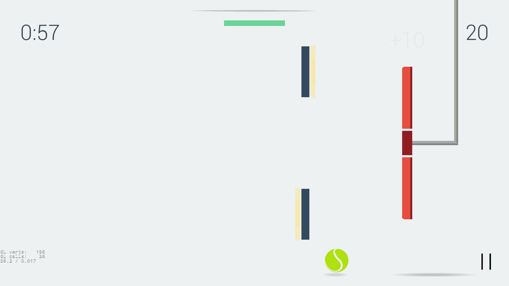

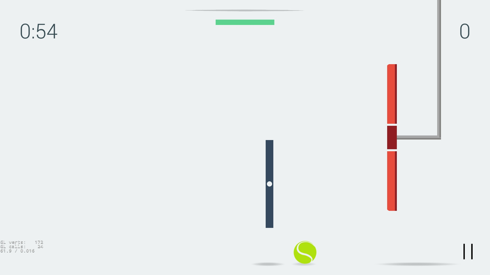

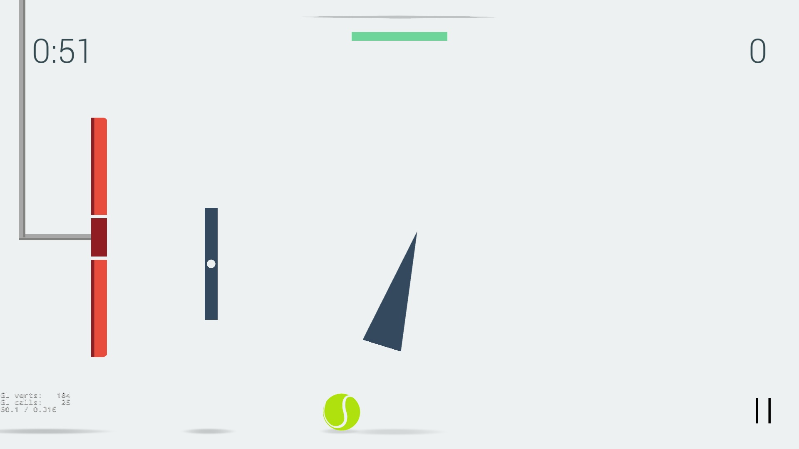

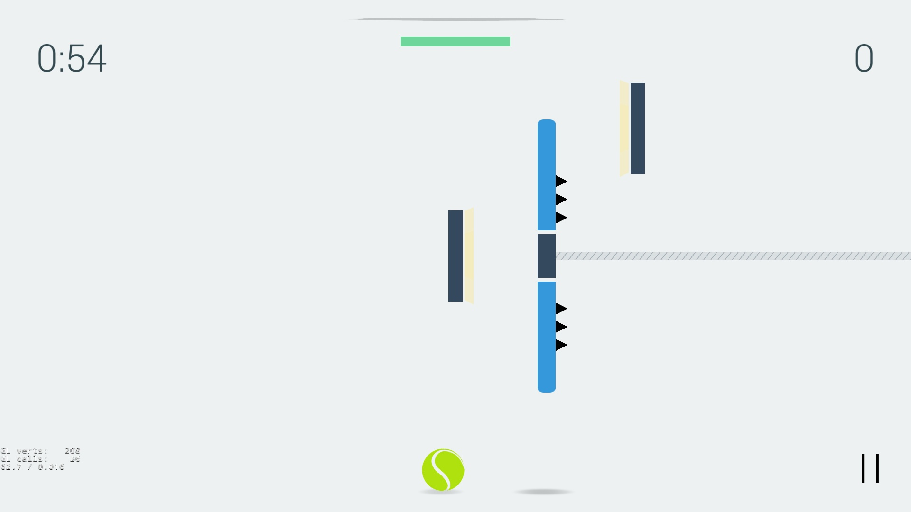

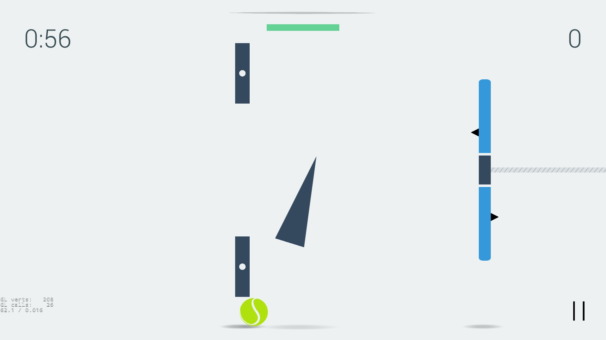
